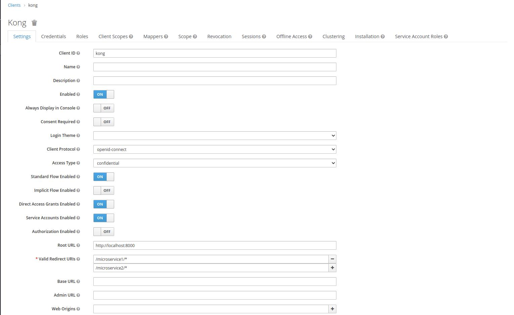
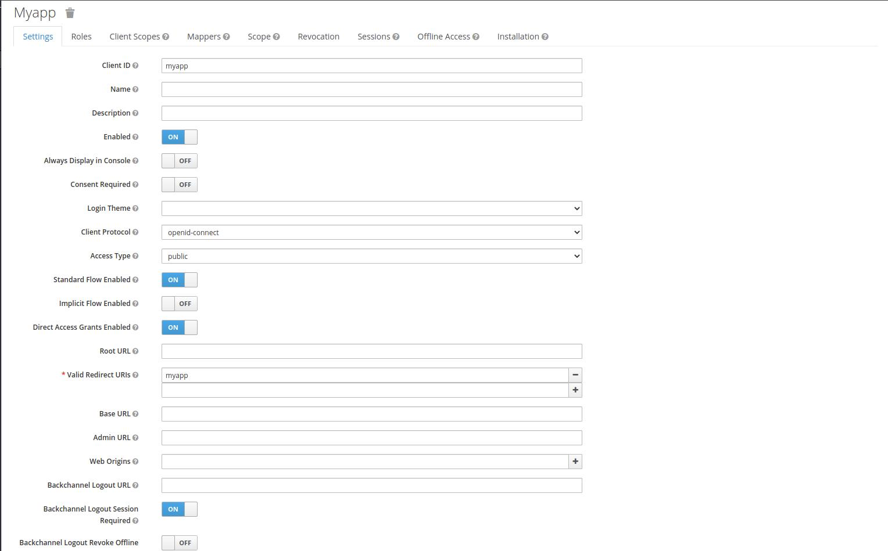
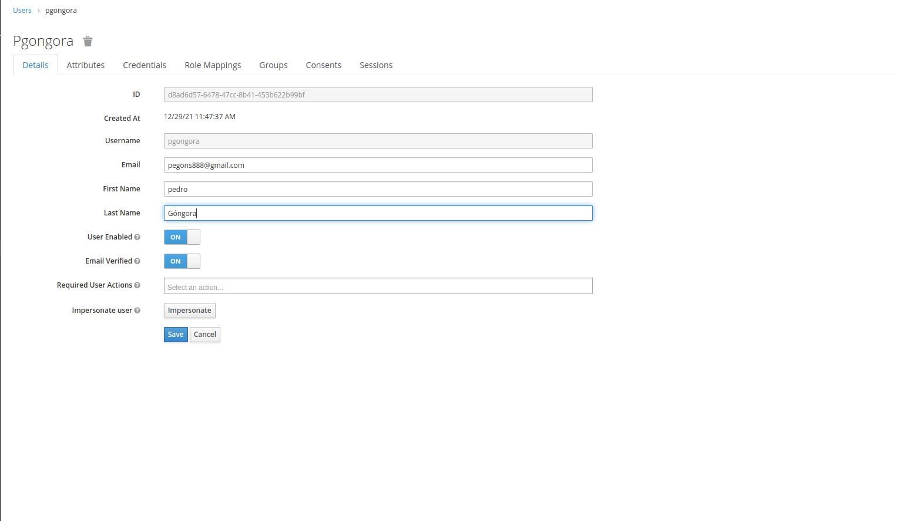
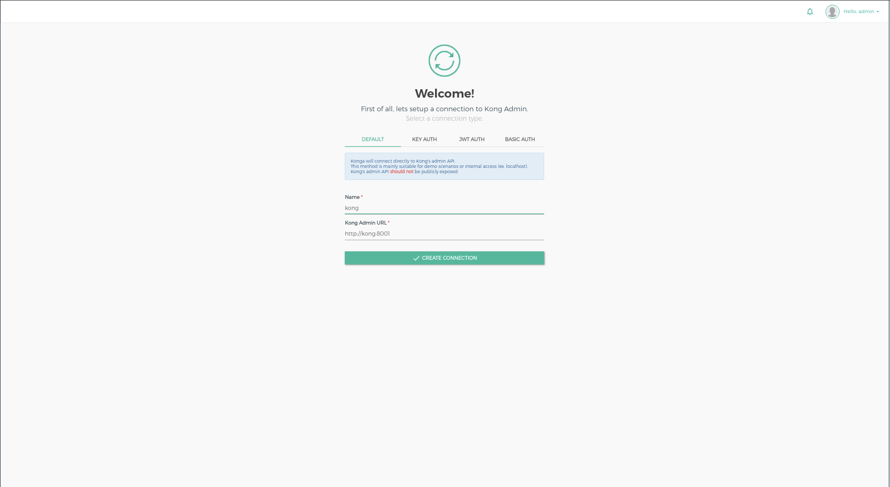
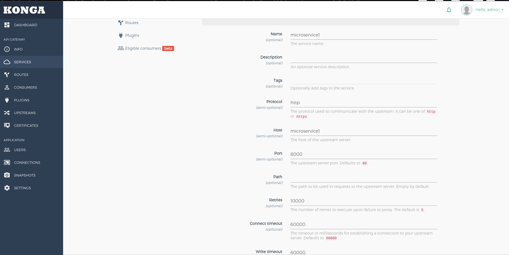
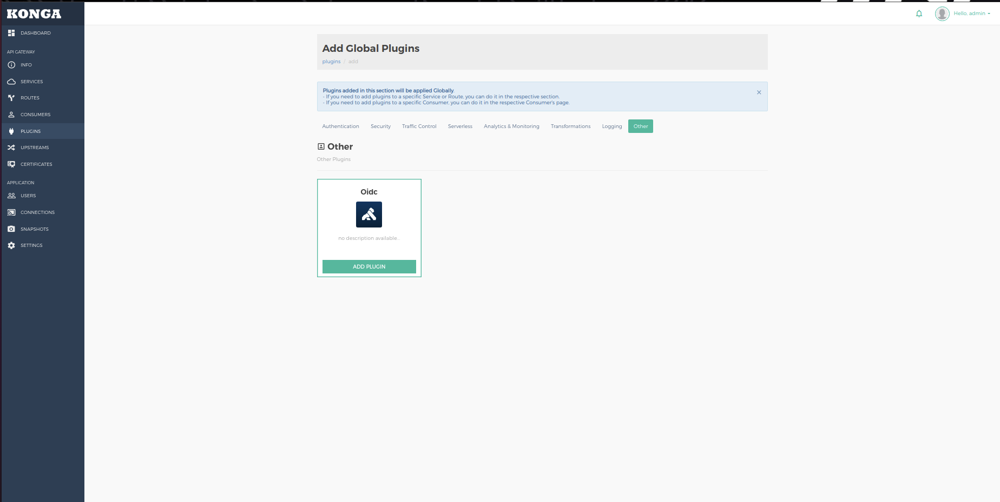
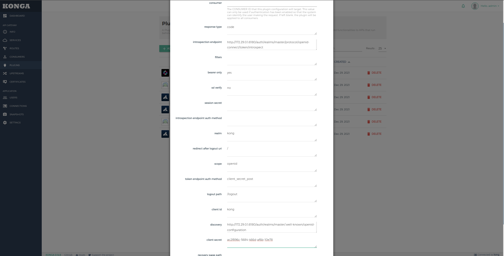
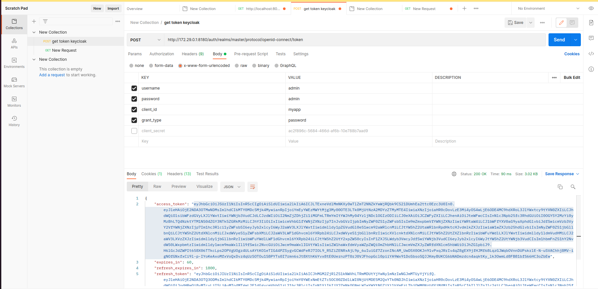

# MICROSERVICE_ARQUITECTURE

A project, to be able to start working with microservices, using laravel rabbitmq and hexagonal architecture.

Before we start, remember to download my other two repositories microservice1 and microservice2, and put them on the same level as this one.
link:

https://github.com/pegons/microservice1

https://github.com/pegons/microservice2

## Getting started

- Once the three repos are at the same level, enter to microservice_infrastructure folder and execute:

- docker-compose build

- If it is the first time you run it, it will take about 15-20 min to install everything.

- Once the process is finished, execute:

   - **docker-compose up**

    - I have left a large part of the process automated, I would only need to enter the mainDB database (**port 33066**)
and create the microservice1 and microservice 2 databases, to be able to execute the migrations in each of the microservices.

  - Once done, go to **http://localhost:15672/** and check that the microservice1_queue, and microservice2_queue have been created.

# #KONG

The project includes a gateway api for communication with microservices.
Kong will take care of this. Konga is a client for kong configuration, and keycloak is a user login and management service, which together with kong allows generating the bearer token for communications with the microservices.

When launching docker-compose up, verify that the KONG container, the Konga container and the KeyCloak container were lifted correctly.

# KEYCLOAK

First we go to the KEYCLOAK configuration

- Keycloak will be available at the URL **http://localhost:8180**.

- You can login using credentials **inside docker-compose.yml** file. (the default credentials are **admin/admin**)

In this case we are going to do it in the master realm, which is the one that comes by default.
We are going to create two clients:
    -A client that will be used by Kong, through the OIDC plugin
    -Another client that we will use to access the API through Kong.




Pay attention to all the fields, or you may have problems later.



We are also going to create a user, to access.
# # KONGA
Now is the time for KONGA **(http://localhost:1337/)**

Before starting and once you have entered the credential configuration data in konga, this screen will appear where we must enter:



Next, we will create two services associated with our two microservices:


Remember that we have two microservices called microservice1 and microservice2. The services associated with these must be created as specified in the image above.

The following is inside the service, create the route **(Again, pay special attention to the values)**.


For the authentication part, we are going to use this plugin, for that we are going to plugin and we do it here so that it affects all services.



Add these two fields:

(According to the realm where you have created the client in keycloak previously and your host_ip, which I say how to obtain it below):
``` http
 introspection_endpoint = http://{HOST_IP}:8180/auth/realms/{REALM}/protocol/openid-connect/token/introspect\
```
``` http
discovery = http://{HOST_IP}:8180/auth/realms/{REALM}/.well-known/openid-configuration
```


We cannot use the localhost ip, since from the kong container, it is not accessible, so we have to look for the ip that our keycloak service has, in this case inspecting the keycloak container we can find:
```json
"ddd_laravel_rabbitmq_template_keycloak": {
"IPAMConfig": null,
"Links": null,
"Aliases": [
"98955ae17608",
"keycloak"
],
"NetworkID": "cbd0e519c9fea95367848468c8e3f84d286495babd3d8aa6065f659592b71026",
"EndpointID": "4645a34ea773a405b0b3f9659217a0a8dc9645ffaaa907b046b3f6ee0c595a1b",
"Gateway": "172.29.0.1",
"IPAddress": "172.29.0.3",
"IPPrefixLen": 16,
"IPv6Gateway": "",
"GlobalIPv6Address": "",
"GlobalIPv6PrefixLen": 0,
"MacAddress": "02: 42: ac: 1d: 00: 03",
"DriverOpts": null
},
```
The **gateway part** is what interests us.

# FINAL TEST
Once everything is configured, we can now try to access a path to any of our microservices (so far we have only configured microservice1)
Get a bearer token:


(Data for postman)
```http
POST http://{HOST_IP}:8180/auth/realms/{REALM}/protocol/openid-connect/token
```

```json
[
  {
    "key": "username",
    "value": "yourUsername",
    "description": "",
    "type": "text",
    "enabled": true
  },
  {
    "key": "password",
    " value ": " yourpassword",
    "description": " ",
    "type ": "text",
    " enabled ": true
  },
  {
    " key ": " client_id ",
    " value ": " myapp ",
    " description ": "",
    "type": "text",
    "enabled": true
  },
  {
    "key": "grant_type",
    "value": "password",
    "description": "",
    "type": "text",
    "enabled": true
  },
  {
    "key": "client_secret",
    "value": "yourClientSecret",
    "description": "",
    "type": "text",
    "enabled": false
  }
]
```



Use it to make a request to KONG (127.0.0.1:8000) that if we are authenticated, it will redirect us to the corresponding microservice, just through the path:
``` http
GET http://localhost:8000/microservice1/hello
```

